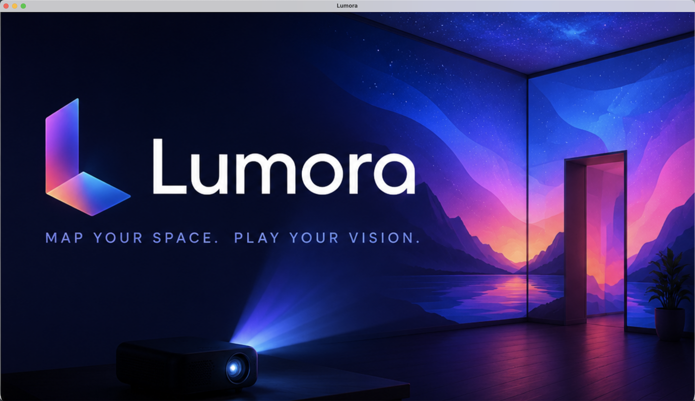
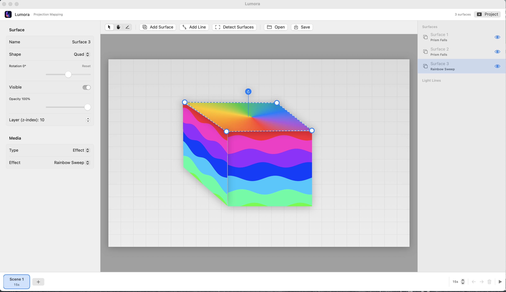
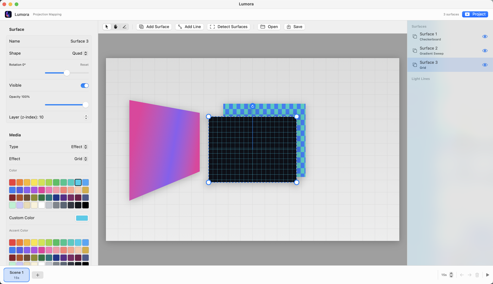
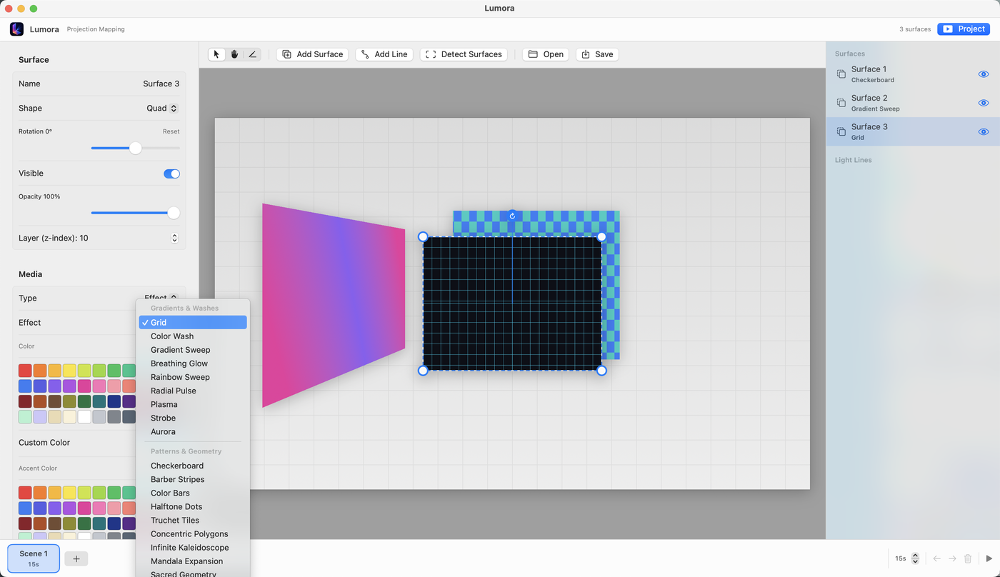
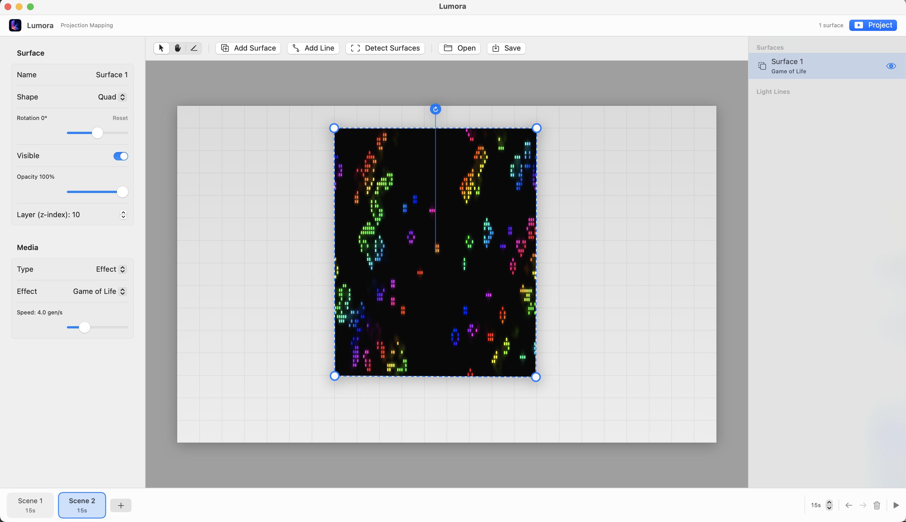

# Lumora

A macOS app for **projection mapping**: treat a room (or any surface) as a
digital canvas, define projection surfaces (or **auto-detect** them from a
photo), assign generative or image-based media to each, arrange them across
**scenes**, preview the whole composition live, and send fullscreen output to a
projector.

## Run it

```sh
swift run          # build + launch
swift build        # build only
swift test         # run the unit tests (geometry, effects, detection pipeline)
```

Requires macOS 14+ and the Xcode command-line tools (Swift 5.9+). You can also
open the package folder in Xcode and hit Run.

## Walkthrough

Launch shows a brief splash, then drops you into the workspace: a room canvas
on the left, the surface list on the right, and a properties panel for
whichever surface is selected.



The workspace with a couple of surfaces already defined — each one warped
onto its quad and running its assigned effect.



**Add Surface** drops a new quad onto the canvas and selects it; the
properties panel on the left fills in with its name, shape, transform, and
media controls.



Setting a surface's media **Type** to *Effect* exposes the **Effect** picker —
one menu, organized into categories (Gradients & Washes, Particles & Nature,
Waves & Motion, …) — for choosing among the 58 built-in generative effects.



Picking an effect assigns it
immediately — the surface starts animating in the live preview.



## What it does

### Surfaces
- **Three shapes** — 4-corner **quads** (perspective-warped), N-point
  **polygons** (3–12 sides), and **ellipses**.
- **Direct manipulation** — drag vertex handles to reshape, or grab the whole
  surface to move it (Arrow vs. Hand pointer modes).
- **Per-surface rotation** — a canvas rotation knob plus a panel slider; quads
  fold rotation into the homography, polygons/ellipses rotate their clipped media.
- **Live preview** — the room canvas shows the real, animating composition.

### Media
Each surface can display:
- **Solid color**
- **Over 100 built-in generative effects**, each animated and warp-aware, with
  primary + accent color controls, chosen via a two-step **Category → Effect**
  picker across 14 categories:
  - *Gradients & Washes*, *Patterns & Geometry*, *Particles & Nature*,
    *Waves & Motion*, *Retro & Digital*, *Fractals* (each a ~2-min generate →
    hold → vanish cycle), *Fields*, *Curves & Grids*, *Ambient & Illusion*,
    and *Edge* (Outline Glow traces a surface's true outline).
  - *3D* — software-rendered rotating torus, sphere, and depth-cued point cloud.
  - *Clocks & Info* — real-time analog/digital clock faces plus a weather-aware
    digital clock (Open-Meteo + CoreLocation).
  - *Christmas Lights* — a bundled tree with on-tree twinkles and sagging
    string-light strands.
  - *Bioluminescent* — Avatar-style glowing night scenes (misty peaks, drifting
    spores, glowing flora, a bioluminescent river).
  - *WebGL & Shaders* — GPU / three.js / p5.js effects rendered in an embedded
    web view (plasma, 3D particle clouds, flow fields, black hole, and more),
    vendored locally (no CDN at runtime).
  - Several effects are **audio-reactive**, driven by the microphone's live
    frequency spectrum.
- **Imported still image**
- **Looping muted video**
- **Laser Trace** — takes an image, edge-detects it (Core Image `CIEdges`), and a
  glowing laser bar sweeps bottom→top; edges light up in the laser color as it
  passes and persist into the full outline, which holds and fades before
  repeating. Selectable color + adjustable trace speed.
- **Contour Trace** — takes an image, detects contours (Vision
  `VNDetectContoursRequest`), and a single pen tip draws them one at a time,
  navigating edge to edge. Selectable color + adjustable trace speed.

### Scenes
- A project is an ordered list of **scenes**, each with its own surfaces, light
  lines, and play duration.
- A scene strip below the canvas selects / adds / deletes / reorders / renames
  scenes and sets each one's duration; a Preview toggle cycles through them in
  the editor.
- Projection **auto-advances** through scenes by duration and loops.
- Adding a scene can **copy the surface outlines** from the current scene (each
  rendering the grid alignment effect) so you can re-map the same layout.

### Auto surface detection
- **Detect Surfaces** finds large flat surfaces in a room photo using a
  pure-Swift **classical computer-vision pipeline** (Canny edges → Hough lines →
  contour tracing → region segmentation → validation → property/confidence
  ranking) — no OpenCV, no ML, fully offline and unit-tested. Detected surfaces
  come out as **quads** (perspective-warpable) or **polygons**.
- **Projected-boundary calibration** — clicking Detect Surfaces projects a
  glowing boundary with four magenta corner markers; you photograph the scene,
  upload the photo, and the app perspective-rectifies it to the projector
  rectangle before detection, so found surfaces align to what the projector
  actually illuminates (falls back to the raw photo if the markers aren't found).
- A **review sheet** overlays the detected surfaces (numbered, quad-by-default
  with per-surface revert-to-polygon, draggable corners) so you keep / discard /
  adjust before adding them to the canvas.

### Projection & project files
- **Projection mode** — opens fullscreen output on a second display (projector)
  if present, otherwise the main display.
- **Save / Open** — projects persist to `.lumora` JSON (⌘S / ⌘O).
- **Surface list & properties panel** — add / delete / rename (inline in the
  sidebar) / hide surfaces, set opacity, pick shape, and assign media.

## Architecture

- **`LumoraKit`** — pure, UI-free geometry + model core (unit-tested `Homography`
  math; `Surface`, `MediaAssignment`, `EffectKind`, `RGBAColor` value types) plus
  the classical-CV **surface-detection pipeline** (edges, lines, contours,
  regions, ranking) and calibration (marker detection + perspective rectify). No
  SwiftUI/AppKit dependency.
- **`Lumora`** — the SwiftUI app (state store, canvas/editor/projection views,
  effect renderers, and embedded `WKWebView` pages for the WebGL/three.js/p5
  effects).

Perspective warping uses the pure `Homography` (rect → quad) driven through
SwiftUI's native `ProjectionTransform`. Generative effects are stateless
`Canvas` closures driven only by a shared `time`, grouped into per-category
`@ViewBuilder` renderers.

## Roadmap

Per-surface playback settings (loop / volume / speed / fill mode),
projector-native output to remove letterboxing, a real document model
(current-doc tracking, recent files), and optional skeletonization for
single-line contour tracing. See `docs/BACKLOG.md`.
